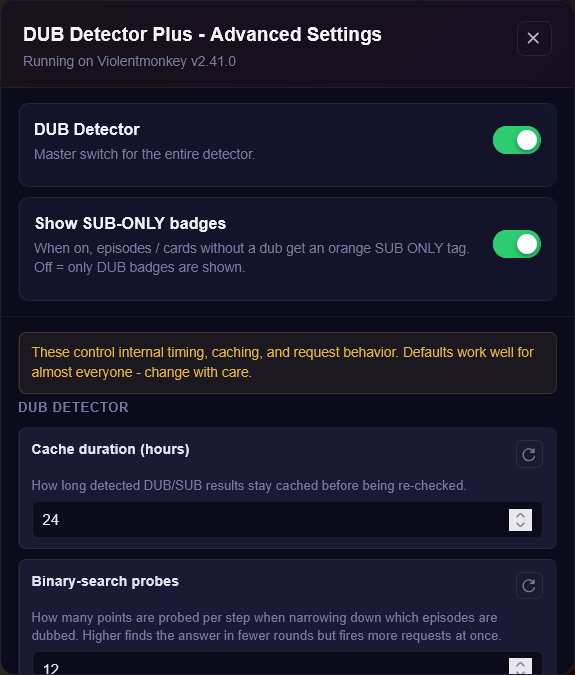
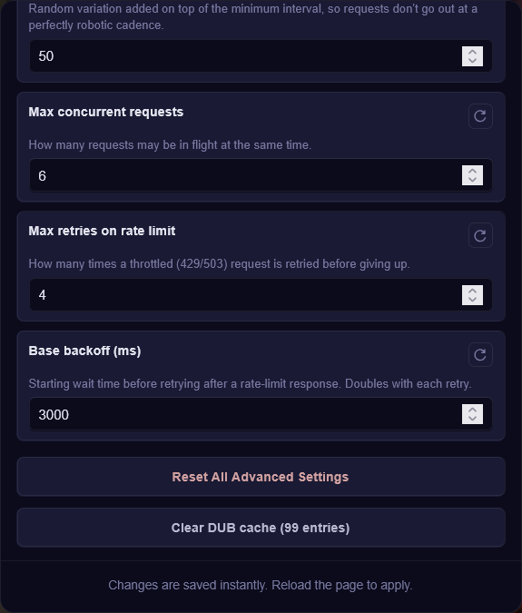

# animepahe dub detector plus

A userscript that tells you which episodes on animepahe are dubbed before you click into them, so you stop opening the player just to find out it's sub-only.

## What it does

animepahe doesn't make it obvious which episodes have an English dub and which don't — you usually have to open each episode and check. This script fixes that by scanning episode lists and homepage cards in the background and dropping a badge on anything that has a dub available.

- On an anime's episode list, dubbed episodes get a **DUB** badge and (optionally) everything else gets a **SUB ONLY** badge
- On the homepage, cards show how many episodes are dubbed out of the total
- On the player page itself, you get a badge next to the title so you know what you're watching
- A small status pill in the bottom-right corner shows scan progress while it works

Since most shows dub episodes in order starting from episode 1, the script uses a binary search instead of checking every single episode one by one. That means it can figure out where the dub cutoff is with a handful of requests instead of dozens, and it caches the result afterward so it doesn't need to check again for a while.

There's also a built-in request throttler so it doesn't hammer the site — requests are spaced out, limited in how many run at once, and it backs off automatically if it hits a rate limit or a Cloudflare challenge.

## Installing

You'll need a userscript manager first — [Violentmonkey](https://violentmonkey.github.io/) or [ScriptCat](https://scriptcat.org/) both work fine.

Once that's installed, grab the script from Greasy Fork: [animepahe-dub-detector-plus](https://greasyfork.org/en/scripts/585305-animepahe-dub-detector-plus). Your script manager should pick it up and prompt you to install it — no build step, no config file, just install and go.

You can also install it manually by opening `animepahe-dub-detector-plus.user.js` from this repo the same way.

## Settings

Click the script manager icon in your toolbar and you'll find a couple of menu commands, including one to open the settings panel directly in the page. From there you can:

- Turn the whole detector on or off
- Turn SUB ONLY badges on or off (maybe you only care about seeing dubs)
- Clear the cache if something looks stale
- Tune the more technical stuff — cache duration, how aggressive the binary search is, batch sizes, request timing, retry behavior

The defaults are tuned to be reasonable for most people, so you shouldn't need to touch the advanced section unless you're running into rate limits or just want faster scans.

  
  

## Notes

- Works on both `animepahe.pw` and `animepahe.org`
- Everything is stored locally through your script manager's storage — nothing gets sent anywhere else
- If animepahe changes its markup or API responses, badge detection may break until the script is updated

## License

GPLv3 — see `LICENSE`.
