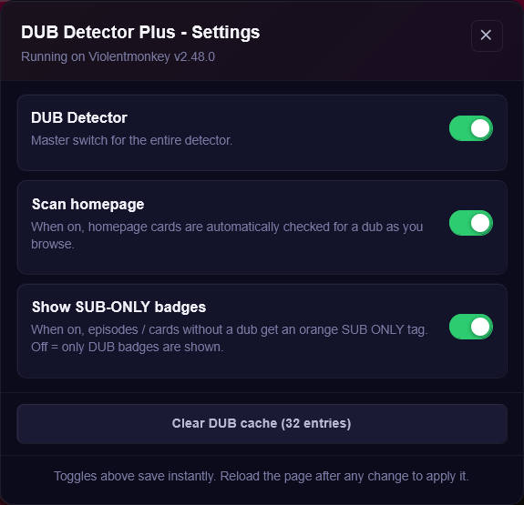

# animepahe DUB Detector Plus

Puts a DUB or SUB ONLY badge on every episode so you don't have to click in and check.

Version 2.2.0. Free, open source, GPL v3 (see LICENSE).

## What it does

Adds a DUB badge to episodes that have an English dub, and a SUB ONLY badge to the ones that don't. Works on the homepage, the episode list, and the video player, all automatically, no clicking required. Once it's checked an episode it remembers the result, so it won't ask again every time you load the page.

## Screenshots

## How to install

1. Get a userscript manager. ScriptCat and Violentmonkey are both free, open source, and work in Chrome, Firefox, and Edge.
2. Open the script's [Greasyfork page](https://greasyfork.org/en/scripts/585305-animepahe-dub-detector-plus).
3. Click "Install this script" and confirm in your userscript manager's install screen.
4. Load animepahe.pw or animepahe.org. The badges just show up.

## Settings

Open your userscript manager and pick "⚙️ Open DUB Detector Settings". From there you can:

- Turn the whole thing on or off
- Turn homepage checking on or off (on by default)
- Turn SUB ONLY badges on or off (grayed out while the detector itself is off, since there's nothing to show)
- Clear the saved results for a fresh check

## How it works

It only looks at animepahe's own pages to figure out what's dubbed. Nothing gets sent anywhere else, and there's no account or sign-in involved.

## License

GNU GPL v3.0. You're free to use and modify this however you like, just keep any version you share under the same license. Full text in [LICENSE](LICENSE).
